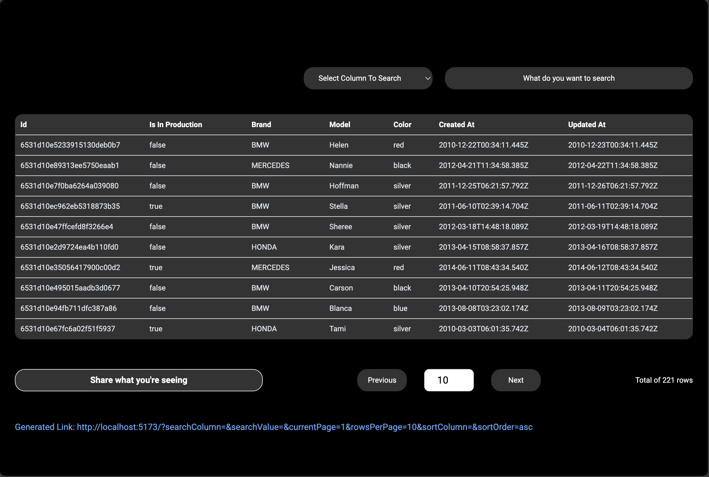
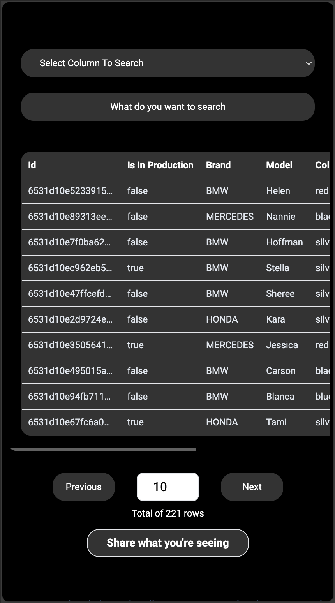

# Colmer the Developer

Welcome to Corplabs Assignment. Build using Vite, React and Jest.

## Project Structure

### Setup instruction to run the code
- cd corplab-assignment;
- npm install;
- npm run dev;

Start the frontend development server using Vite.

### Testing Setup to run the tests
- npm run test

Test is located at corplab-assignment/src/__test__/

### Main Technical Decision
- I was planning to use a UI Kit to build the table. But somehow I thought that might affect the way I could demonstrate the way I code. I try my very best to code it as clean as possible and style it using Tailwind CSS
- I was thinking about having express.js as backend to generate link. But somehow I manage to get it setup at frontend. But if we want to scale it to store our data to database server, we might to implement a backend to handle API endpoint and it could help our code base to be much more secure.

### Comments
- You can have a try over at your phone by clicking into this [Link](https://corplab-assignment.web.app/). I took the effort to host it on Firebase.

## Technologies Used

#### Frontend
- [Vite](https://vitejs.dev/) - Frontend build tool
- [React](https://reactjs.org/) - JavaScript library for building user interfaces

#### Testing
- [Jest](https://jestjs.io/docs/getting-started) - Framework that was used in this project for testing

#### Hosting
- The frontend is hosted on this [Link](https://corplab-assignment.web.app/)
- [Firebase](https://firebase.google.com/) - Platform for building web and mobile application

#### Desktop Version

  

#### Mobile Version

  

